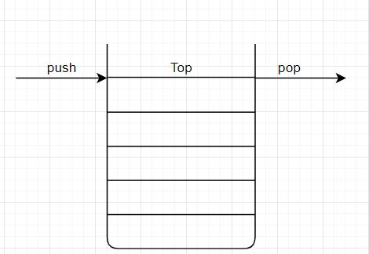

# Reading questions :

## Functional Programming Concepts

1. What is a ‘call’?

    It is used primarily to invoke the functions 
2. How many ‘calls’ can happen at once?

    one at a time from the top to bottom (frist come first serve)
3. What does LIFO mean?

    Last in first out 
4. Draw an example of a call stack and the functions that would need to be invoked to generate that call stack.

    
5. What causes a Stack Overflow?

    when there is a recursive function without an exit point.

## JavaScript error messages

1. What is a ‘refrence error’? 

    It comes when you use a varible without declaring it yet
2. What is a ‘syntax error’?

    It is when you have a word that can't be parsed in terms of syntax
3. What is a ‘range error’?

    when you give an object some sort of length but the wrong size.
4. What is a ‘tyep error’?

    When using a type like number, string...etc and you use the incompatible like a number in a string. 
5. What is a breakpoint?

    It is used when you want to break your debugger statement in a specific line.
6. What does the word ‘debugger’ do in your code?

    ends the program can calls for the funcation.